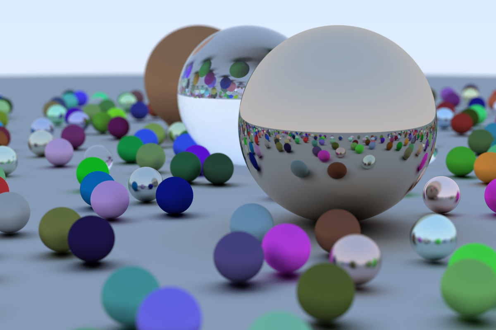

# Ray-Tracing-in-One-Weekend.zig

[Ray Tracing in One Weekend](https://raytracing.github.io/books/RayTracingInOneWeekend.html) in Zig!



## How to execute

```sh
git clone https://github.com/ryoppippi/Ray-Tracing-in-One-Weekend.zig
zig build -Drelease-fast=true run >> image.ppm
```

Note that this build works on zig 0.10.0 (because of async api is not work on self-hosted compiler)

## Bechmark

- Machine: Mac Mini 2021
- Chip: Apple M1
- Memory: 16GB
- OS: macOS 12.4（21F79）
- Zig: 0.10.0-dev.3007+6ba2fb3db

Before Multithreading [9305860](https://github.com/ryoppippi/Ray-Tracing-in-One-Weekend.zig/tree/week1.2)

```sh
________________________________________________________
Executed in  879.32 secs    fish           external
   usr time  863.33 secs   35.00 micros  863.33 secs
   sys time   15.33 secs  550.00 micros   15.33 secs
```

After Multithreading

```sh
________________________________________________________
Executed in  190.77 secs    fish           external
   usr time   22.87 mins   47.00 micros   22.87 mins
   sys time    0.09 mins  825.00 micros    0.09 mins
```

## License

MIT

## Author

Ryotaro "Justin" Kimura (a.k.a. ryoppippi)
